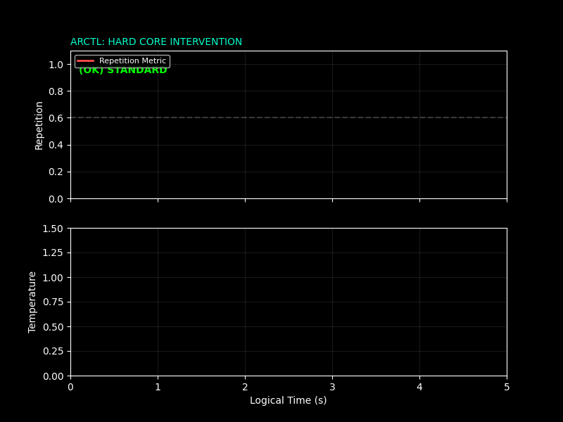

# arctl: Adaptive Resonance Control

[](https://opensource.org/licenses/MIT)
[](https://github.com/graevka-lab/arctl)
[](tests/)

> "Code is for machines. Resonance is for intelligence."

### 1. Phase Space Trajectory (3D)
Visualizing the system's movement through Repetition (X), Energy (Y), and Temperature (Z).


### 2. Intervention Telemetry (2D)
Real-time monitoring of repetition loops and thermal spikes.


**arctl** is a hybrid control architecture...
`arctl` is a hybrid control architecture for LLM inference, combining:
1. **Hard Core** — a deterministic state machine for physical sampling control.
2. **Soft Core** — a semantic resonance engine for latent space steering.

---

## 🎯 The Problem: Chaos in the Latent Space

Modern LLMs suffer from three fundamental flaws:
1.  **The Knowledge Dump:** Training data is "emotionally polluted". Technical specs are mixed with fiction.
2.  **Temporal Blindness:** Models confuse Past, Present, and Future because they live in discrete time.
3.  **Lack of Control:** There is no mechanism to manage the "Pattern of Thought" (e.g., force a specific emotional mix).

**The Experiment:**
Ask an LLM to explain "Pulse Width Modulation" (PWM) with different emotional overlays:
*   **Joy:** "PWM is a dance of signals!" (Metaphorical distortion).
*   **Fear:** "PWM is dangerous, circuits might explode!" (Risk hallucination).
*   **Calm:** "PWM controls power via duty cycle." (Technical truth).

**Conclusion:** Hallucinations are often **Resonance Errors**. To fix this, we need to enforce the correct **Resonance Profile** (a precise mix of emotions) for each task.

---

## 🛠️ The Solution: Hybrid Control

We cannot rebuild the dataset (yet). But we can control the **Resonance Profile** of the inference.

`arctl` implements a two-layer control system:

### 1. The Hard Core (Kernel)
A deterministic Python state machine.
- **Role:** The Bodyguard.
- **Function:** Monitors entropy and repetition. If the model loops, it physically forces a temperature spike (`EMERGENCY`) or shuts down (`FALLBACK`).
- **Philosophy:** Failure must be explicit. No infinite loops.
- **Spec:** Formally verified via TLA+ (see `spec/kernel.tla`).

### 2. The Soft Core (Resonance Engine)
*Status: Experimental / Demonstration*

A semantic steering system that injects "Cognitive Anchors" (Semantic Code) into the context.
*   **Function:** Tunes the model's latent space to the correct frequency (e.g., `CALM` for coding).
*   **Innovation:** Verifies truth by checking **Invariance** across multiple emotional states.
*   **Limitation:** Semantic injection consumes tokens and scales poorly. It is included here as a **Proof of Concept**. Ideally, this logic should be embedded directly into the Knowledge Base during training.

---

## 🗂️ Project Structure
```text
arctl-project/
├── arctl/                     # Core package
│   ├── __init__.py            # Package initialization
│   ├── core/                  # Hard Core (state machine, chronos)
│   │   ├── __init__.py
│   │   ├── kernel.py          # Main state machine
│   │   ├── chronos.py         # Temporal synchronization
│   │   ├── states.py          # State definitions
│   │   ├── profiles.py        # Resonance profiles
│   │   ├── anchors.py         # Cognitive anchors
│   │   └── mythos.py          # Semantic protocol
│   ├── engine/                # Soft Core (resonance synthesizer)
│   │   ├── __init__.py
│   │   └── synthesizer.py     # Multi-pass synthesis
│   └── verification/          # Verification & metrics
│       ├── __init__.py
│       ├── lexical.py         # Lexical analysis
│       ├── metrics.py         # Resonance verification
│       └── uncertainty.py     # Uncertainty scoring
├── tests/                     # Test suite
│   ├── __init__.py
│   ├── test_core.py           # Unit tests (21 tests)
│   ├── test_integration.py    # Integration tests (8 tests)
│   └── benchmarks.py          # Performance benchmarks
├── examples/                  # Working examples & demos
│   ├── resonance_demo.py      # Resonance analysis demo
│   ├── telemetry_simulation.py # Real-time monitoring
│   └── visualize_phase_space.py # 3D phase space visualization
├── docs/                      # Documentation
│   ├── ARCHITECTURE.md        # System architecture
│   ├── TESTING.md             # Testing guide
│   └── TROUBLESHOOTING.md     # Common issues & solutions
├── spec/                      # Formal specifications
│   └── kernel.tla             # TLA+ specification
├── LICENSE                    # MIT License
├── README.md                  # This file
├── arctl_demo.gif             # 2D Telemetry visualization asset
├── arctl_phase_space.gif      # 3D Phase Space visualization asset
├── pyproject.toml             # Project configuration
├── pytest.ini                 # Pytest configuration
└── run_tests.py               # Test runner
```

---

## 🚀 Quick Start

### Installation
```bash
# Clone the repository
git clone https://github.com/graevka-lab/arctl.git
cd arctl

# Install in development mode
pip install -e .

# (Optional) Install resonance verification support
pip install sentence-transformers
```

### Running Tests
```bash
# Run all tests (29 tests total)
python run_tests.py

# Run specific test suite
python run_tests.py --unit          # Unit tests only
python run_tests.py --integration   # Integration tests only
python run_tests.py --bench         # Performance benchmarks
```

### Running Demos

1. **Resonance Demo (Soft Core)**  
   See how the engine extracts truth from different perspectives:  
   ```bash
   python examples/resonance_demo.py
   ```

2. **Telemetry Simulation**  
   Real-time monitoring visualization:  
   ```bash
   python examples/telemetry_simulation.py
   ```

3. **Phase Space Visualization**  
   3D trajectory through state space:  
   ```bash
   python examples/visualize_phase_space.py
   ```

---

## 🕰️ The Chronos Axiom

Standard LLMs suffer from "Future Shock" — they deny events that happened after their training cutoff.  
`arctl` solves this not by retraining, but by **Temporal Alignment**.

- **SYNC (< 1 min):** Immediate flow. High context retention.
- **LAG (> 1 min):** User lived through time the model didn't see.
- **GAP (> 24 hours):** Significant reality shift. Context reset recommended.

---

## 📜 Philosophy

We believe that **Truth is Resonance**.  
Instead of optimizing for a single "best" token (RLHF), we search for the semantic structure that survives the perturbation of emotional states.

If a fact is true, it remains true whether you are Calm, Joyful, or Vigilant.  
If it changes, it is an illusion.

For a deeper dive into the system architecture, see [docs/ARCHITECTURE.md](docs/ARCHITECTURE.md).  
For testing guidance, see [docs/TESTING.md](docs/TESTING.md).  

---

## 🤝 Contributing

This project is a **Signal** to the broader community about control mechanisms for LLMs.  
Contributions, discussions, and feedback are welcome!

If you have the hardware to retrain foundation models on Resonance-Aligned Data — let's connect.

## 📧 Contact 

**GitHub:** [@graevka-lab](https://github.com/graevka-lab)

**X (Twitter):** [@Graevka](https://x.com/Graevka)

**LinkedIn:** [Graevka Suvorov](https://www.linkedin.com/in/graevka-s-97332b369/)

---

## License

MIT License — See [LICENSE](LICENSE) for details.

Built for those who understand that:
> No hidden state.  
> No infinite loops.  
> No recovery without cost.  
> Failure is explicit.